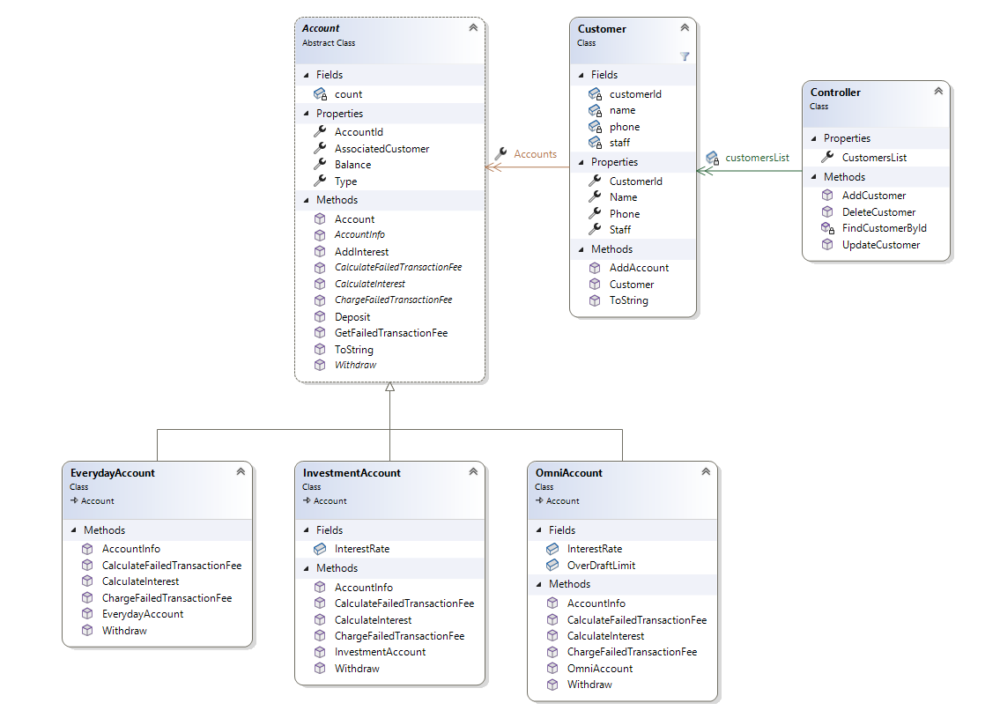

# Bank Account Application

## Overview
This C# Windows Form project is a Bank Account Management Application that facilitates deposit and withdrawal transactions for both regular customers and bank staff. The application supports various types of bank accounts, each with unique features. Customers, including bank staff, can manage their accounts through a user-friendly interface.

## Project Details
The primary objective is to create an application that addresses the financial requirements of customers managing their bank accounts. The application differentiates between regular customers and bank staff, offering the latter a 50% discount on incurred fees.

### Customer Information
Customers are identified by a Customer Number, Name, and Contact Details. Bank staff, who are also customers, share the same account functionality as regular customers but with a fee discount.

### Account Types
1. **Everyday Account:**
   - No Interest
   - No Overdraft
   - No Transaction Fees
   - Deposit Limit of $10000/transaction apply to all account

2. **Investment Account:**
   - Variable Interest Rates Applied to All Funds - 4%
   - No Overdraft Allowed
   - Fee for Failed Transactions - $10 (Staff 50% discount on fees)
   - Ability to calculate and add interest to the balance
   -  Deposit Limit of $10000/transaction apply to all account

3. **Omni Account:**
   - Interest Rates Applied Only on Balances Over $1000 - 4%
   - Specified Overdraft Permitted - $100
   - Fee Incurred for Failed Transactions - $10 (Staff 50% discount on fees)
   - Ability to calculate and add interest to the balance
   -  Deposit Limit of $10000/transaction apply to all account

4. **Transfers Between own Account**
   - No Overdraft Permitted while transfer between own accounts. Only available balance can be transfer between own accounts
   - No Fee Incurred for Failed Transactions while transferring to own accounts

## Instructions

### Environment Setup
1. Ensure you have Visual Studio installed.
2. Clone the repository to your local machine.

### Building the Project
1. Open the solution file in Visual Studio.
2. Build the solution.

### Running the Application
1. Set the startup project to the main application.
2. Run the application.

### Running Unit Tests
1. Open the unit test project in Visual Studio.
2. Run the tests.

### UML Class Diagram

